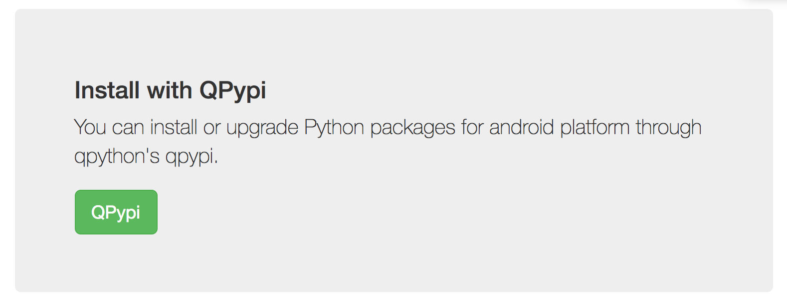
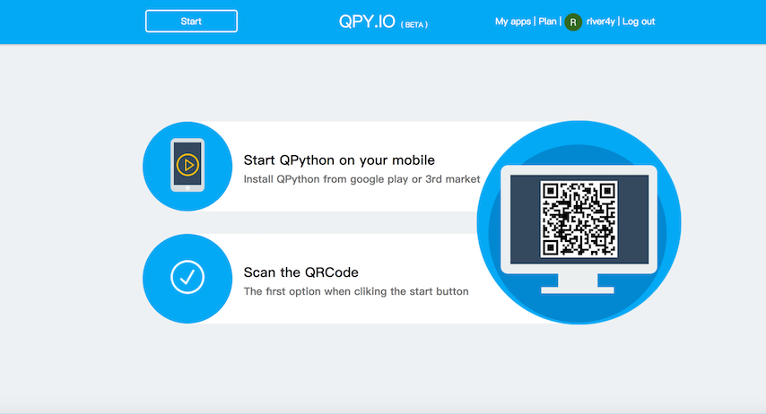

QPython Open API 
=====================================================
QPython has an open activity which allow you run qpython from outside.

The MPyAPI's definition seems like the following:

::

        <activity 
            android:name="org.qpython.qpylib.MPyApi"
            android:label="@string/qpy_run_with_share"
            android:screenOrientation="user"
            android:configChanges="orientation|keyboardHidden"
            android:exported="true">
            <intent-filter>
                <action android:name="org.qpython.qpylib.action.MPyApi" />
                <category android:name="android.intent.category.DEFAULT" />
                <category android:name="android.intent.category.LAUNCHER" />
            </intent-filter>
            <intent-filter>
                <action android:name="android.intent.action.VIEW" />
                <category android:name="android.intent.category.DEFAULT" />
                <category android:name="android.intent.category.BROWSABLE" />
                <data android:scheme="http" />
                <data android:scheme="https" />
            </intent-filter>
            <intent-filter>
                <action android:name="android.intent.action.SEND"/>
                <category android:name="android.intent.category.DEFAULT"/>
                <data android:mimeType="text/plain"/>
            </intent-filter>
            <intent-filter>
                <action android:name="android.intent.action.SEND"/>
                <category android:name="android.intent.category.DEFAULT"/>
                <data android:mimeType="image/*"/>
            </intent-filter>
        </activity>

**So, with it's help, you could:**

Share some content to QPython's scripts
---------------------------------------------
You could choose some content in some app, and share to qpython's script, then you could handle the content with the **sys.argv[2]**

`Watch the demo video on YouTube <https://www.youtube.com/watch?v=2Y50Yir8TWg>`_

Run QPython's script from your own application
------------------------------------------------------

You can call QPython to run some script or python code in your application by call this activity, like the following sample:

::

    // code sample shows how to call qpython API
    String extPlgPlusName = "org.qpython.qpy";          // QPython package name
    Intent intent = new Intent();
    intent.setClassName(extPlgPlusName, "org.qpython.qpylib.MPyApi");
    intent.setAction(extPlgPlusName + ".action.MPyApi");

    Bundle mBundle = new Bundle();
    mBundle.putString("app", "myappid");
    mBundle.putString("act", "onPyApi");
    mBundle.putString("flag", "onQPyExec"); // any String flag you may use in your context
    mBundle.putString("param", "");         // param String param you may use in your context

    /*
    * The Python code we will run
    */
    String code = "import androidhelper\n" +
                "droid = androidhelper.Android()\n" +
                "line = droid.dialogGetInput()\n" +
                "s = 'Hello %s' % line.result\n" +
                "droid.makeToast(s)\n"

    mBundle.putString("pycode", code);
    intent.putExtras(mBundle);
    startActivityForResult(intent, SCRIPT_EXEC_PY);
    ...

    // And you can handle the qpython callabck result in onActivityResult
    @Override
    protected void onActivityResult(int requestCode, int resultCode, Intent data) {
        if (requestCode == SCRIPT_EXEC_PY) {
            if (data!=null) {
                Bundle bundle = data.getExtras();
                String flag = bundle.getString("flag");
                String param = bundle.getString("param");
                String result = bundle.getString("result"); // Result your Pycode generate
                Toast.makeText(this, "onQPyExec: return ("+result+")", Toast.LENGTH_SHORT).show();
            } else {
                Toast.makeText(this, "onQPyExec: data is null", Toast.LENGTH_SHORT).show();

            }
        }
    }

`Checkout the full project from github <https://github.com/qpython-android/app-call-qpython-api>`_

And there is `a production application - QPython Plugin for Tasker <https://play.google.com/store/apps/details?id=com.qpython.tasker2>`_

QPython Online Service
=====================================================

Now the QPython online service only open for QPython, not QPython3.

QPypi
---------------------------------------------------------
Can I install some packages which required pre-compiled ?
Sure, you could install some pre-compiled packages from QPypi, you could find it through "Libraries" on dashboard.

If you couldn't found the package here, you could send email to river@qpython.org .

QPY.IO
---------------------------------------------------
Can I build an independent APK from QPython script?

Sure you can. now the service is **in BETA**, it's a challenging thing. We will publish it as a online service, for we want to let the development process is simple, you don't need to own the development environment set up when you want to build a application.

If you want to try it out or have some business proposal, please contact with us by sending email to river@qpython.org .
