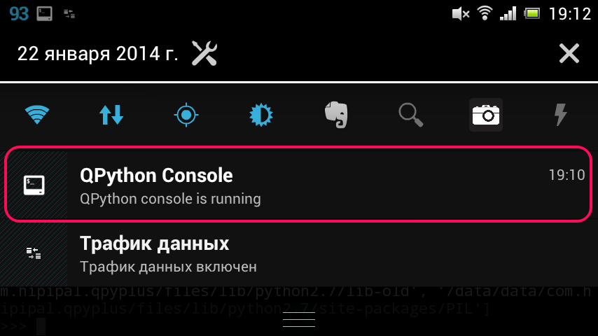

QPython: How To Start
========================
Now, I will introduce the QPython's features through it's interfaces.

1. Dashboard
------------------

.. image:: ../_static/guide_howtostart_pic1.png
   :alt: QPython start

After you installed QPython, start it in the usual way by tapping its icon in the menu. Screenshot on the top of this post shows what you should see when QPython just started. 

**Start button**

By tapping the big button with Python logo in the center of the screen you can 

**Launch your local script or project**

*Get script from QR code* (funny brand new way to share and distribute your code, you can create QRCode through `QPython's QRCode generator <http://qpython.com/#qrcode>`_

Now you can install many 3rd libaries ( pure python libraries mainly ) through pip_console.py script.

If you want QPython to run some script of project when you click the start button, you can make it by setting default program in setting activity.

**Developer kit dashboard**

If you swipe to the left instead of tapping, you will see another (second) main screen of QPython *(Pic. 2)*. As for me, it is much more useful and comfortable for developer.

.. image:: ../_static/guide_howtostart_pic2.png
   :alt: QPython develop dashboard

Tools available here:

* **Console** — yes, it's regular Python console, feel free to comunicate with interpreter directly
* **Editor** — QPython has a nice text editor integrated with the rest, you can write code and run it without leaving the application
* **My QPython** — here you can find your scripts and projects
* **System** — maintain libraries and components: install and uninstall them
* **Package Index** opens the page `QPyPI <http://qpypi.qpython.org/>`_ in browser allowing to install packages listed there
* **Community** leads to `QPython.org <http://qpython.org/>`_ page. Feel free to join or ask&answer questions in the QPython community.

By long clicking on the console or editor, you have chance to create the shortcut on desktop which allow you enter console or editor directly.

Next, let's see the console and the editor. 

2. Console and editor
-------------------------

.. image:: ../_static/guide_howtostart_pic3.png
   :alt: QPython console

As I said before, there is an ordinary Python console. Many people usually use it to explore objects' properties, consult about syntax and test their ideas. You can type your commands directly and Python interpreter will execute them. You can open additional consoles by tapping the plus button (1) and usedrop-down list on the upper left corner to switch between consoles (2). To close the console just tap the close button (3).

Please note, there will be notification in the notification bar unless you explicitly close the console and you always can reach the open console by tapping the notification. 

.. image:: ../_static/guide_howtostart_pic5.png
   :alt: QPython editor

The editor allows you obviously (hello Cap!) enter and modify text. Here you can develop your scripts, save them and execute. The editor supports Python syntax highlighting and shows line numbers (there is no ability to go to the line by number though). *(above picture)*

When typing, you can easily control indentation level (which is critical for Python code) using two buttons on the toolbar (1). Next buttons on the toolbar are **Save** and **Save As** (2), then goes **Run** (3), **Undo**, **Search**, **Recent Files** and **Settings** buttons. Also there are two buttons on the top: **Open** and **New** (5).

When saving, don't forget to add `.py` estension to the file name since the editor don't do it for you.

3. Programs
--------------------
You can find the scripts or projects in My QPython. My QPython contains the scripts and Projects. 

By long clicking on script or project, you have chance to create the shortcut for the script or project. Once you have created the shortcuts on desktop, you can directly run the script or project from desktop.

**Scripts**
Scripts : A single script. The scripts are in the  /sdcard/com.hipipal.qpyplus/scripts directory.
If you want your script could be found in My QPython, please upload it to this directory.

When you click the script, you can choose the following actions:

- Run : Run the script
- Open : Edit the script with built-in editor
- Rename : Rename the script
- Delete : Delete the script

**Projects**
Projects : A directory which should contain the main.py as the project's default launch script, and you can put other dependency 3rd libraries or resources in the same directory, if you want your project could be found in My QPython, please upload them into this directory.

When you click on the project, you can choose the following actions:

- Run : run the project
- Open : use it to explore project's resources
- Rename : Rename the project
- Delete : Delete the project

4. Libraries 
--------------

By installing 3rd libraries, you can extend your qpython's programming ability quickly. There are some ways to install libraries.

**QPypi**

You can install some pre-built libraries from QPypi, like numpy etc.

**Pip console**

You can install most pure python libraries through pip console.

Besides the two ways above, you could copy libraries into the /sdcard/qpython/lib/python2.7/site-packages in your device.

*Notice:*
Some libraries mixed with c/c++ files could not be install through pip console for the android lacks the compiler environment, you could ask help from qpython developer team.

5. Community
--------------
It will redirect to the QPython.org, including somthe source of this documentation, and there are some qpython user communities' link, many questions of qpython usage or programming could be asked in the community.

`Thanks dmych offer the first draft in his blog <http://onetimeblog.logdown.com/posts/2014/01/22/qpython-how-to-start>`_

