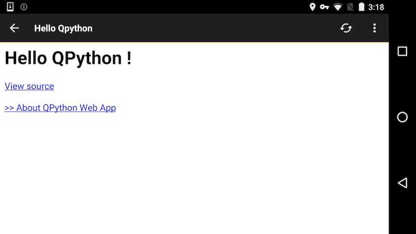

What can QPython do?
====================================

Why should I choose QPython
------------------------
QPython offer **an amazing developing experience**, Now you could write & test & run your programs from your anroid, not the PC, Laptop.

We think QPython's programming style may become popular in the future.

QPython's main features
-------------------------
You can do most jobs through QPython just like the way that Python does on PC/Laptop.

**Libraries**

- QPython supports most stardard Python libraries.

- QPython supports many 3rd Python libraries which implemented with pure Python code.

- QPython supports some Python libraries mixed with C/C++ code which pre-compiled by QPython develop team.

- QPython allows you put on the libraries by yourself.

Besides these, QPython offers some extra features which Python doesn't offer, Like:

- Android APIs Access(Like SMS, GPS, NFC, BLUETOOTH etc)

*Why QPython require so many permissions?*

QPython need these permissions to access Android's API.

**Runtime modes**

QPython supports several runtime modes for android.

**Console mode**

It's the default runtime mode in QPython, it's very common in PC/laptop.

**Kivy mode**

QPython supports `Kivy <http://kivy.org>`_ as the GUI programming solution.

Kivy is an open source Python library for rapid development of applications that make use of innovative user interfaces, such as multi-touch apps.

Your device should support opengl2.0 for supporting kivy mode.

By insert into the following header in your script, you can let your script run with kivy mode.

::

    #qpy:kivy

If your library require the opengl driver, you shoule declare the kivy mode header in your script, like the jnius.

*NOTE: QPython3 didn't support this mode yet*

**WebApp mode**

We recommend you implement WebApp with QPython for it offer the easy to accomplish UI and Take advantage of Python's fast programming strong point.

WebApp will start a webview in front, and run a python web service background. 
You could use *bottle*(QPython built-in library) to implement the web service, or you could install *django* / *flask* framework also.

By insert into the following header in your script, you can let your script run with webapp mode.

::

    #qpy:webapp:<app title>
    #qpy:<fullscreen or remove this line>
    #qpy://<ip:port:path>

For example

::

    #qpy:webapp:Hello QPython
    #qpy://localhost:8080/hello

The previous should start a webview which should load the *http://localhost:8080/hello* as the default page, and the webview will keep the titlebar which title is "Hello QPython", if you add the *#qpy:fullscreen* it will hide the titlebar.

::

    #qpy:webapp:Hello Qpython
    #qpy://127.0.0.1:8080/
    """
    This is a sample for qpython webapp
    """

    from bottle import Bottle, ServerAdapter
    from bottle import run, debug, route, error, static_file, template

    ######### QPYTHON WEB SERVER ###############

    class MyWSGIRefServer(ServerAdapter):
        server = None

        def run(self, handler):
            from wsgiref.simple_server import make_server, WSGIRequestHandler
            if self.quiet:
                class QuietHandler(WSGIRequestHandler):
                    def log_request(*args, **kw): pass
                self.options['handler_class'] = QuietHandler
            self.server = make_server(self.host, self.port, handler, **self.options)
            self.server.serve_forever()

        def stop(self):
            #sys.stderr.close()
            import threading 
            threading.Thread(target=self.server.shutdown).start() 
            #self.server.shutdown()
            self.server.server_close() #<--- alternative but causes bad fd exception
            print "# qpyhttpd stop"

    ######### BUILT-IN ROUTERS ###############
    @route('/__exit', method=['GET','HEAD'])
    def __exit():
        global server
        server.stop()

    @route('/__ping')
    def __ping():
        return "ok"

    @route('/assets/<filepath:path>')
    def server_static(filepath):
        return static_file(filepath, root='/sdcard')

    ######### WEBAPP ROUTERS ###############
    @route('/')
    def home():
        return template('<h1>Hello {{name}} !</h1><a href="/assets/qpython/projects/WebApp Sample/main.py">View source</a>   <a href="http://wiki.qpython.org/doc/program_guide/web_app/">>> About QPython Web App</a>',name='QPython')

    ######### WEBAPP ROUTERS ###############
    app = Bottle()
    app.route('/', method='GET')(home)
    app.route('/__exit', method=['GET','HEAD'])(__exit)
    app.route('/__ping', method=['GET','HEAD'])(__ping)
    app.route('/assets/<filepath:path>', method='GET')(server_static)

    try:
        server = MyWSGIRefServer(host="127.0.0.1", port="8080")
        app.run(server=server,reloader=False)
    except Exception,ex:
        print "Exception: %s" % repr(ex)

In the other part of the code, you could implement a webserver whish serve on localhost:8080 and make the URL /hello implement as your webapp's homepage.

**Q mode**

If you don't want the QPython display some UI, pelase try to use the QScript mode, it could run a script background, just insert the following header into your script:

::

    #qpy:qpyapp
